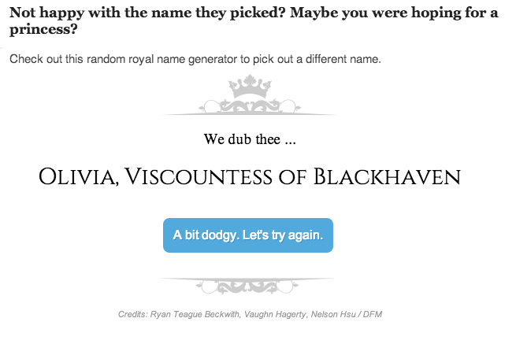

thunderdome-data-random-bs-generator
====================================

What is this crap?
------------------

Ridiculously simple hack to randomly generate a name (or phrase) from sets of words. This began as a toy to troll colleagues in the newsroom and turned into a production tool we used on repeated occasions. There's some inline documentation in [lib/js/thundername.js](lib/js/thundername.js)

A real, live demo: http://www.mercurynews.com/digital-first-media/ci_23721535/royal-baby-name-george-alexander-louis

Perpetrators
------------

Vaughn Hagerty, Nelson Hsu

Assumptions
-----------

* A lack of common sense, a few drinks would probably help

What's in here?
---------------

The project contains the following folders and important files:

* ``index.html`` -- An example app, in this case to name a royal baby
* ``lib/js`` -- Javascript
* ``lib/css`` -- Strangely enough, stylesheets
* ``lib/img`` -- Images lovingly handcrafted by the inimitable Nelson Hsu

License
----------

This code is available under the MIT license. For more information, please see the LICENSE file in this repo.
